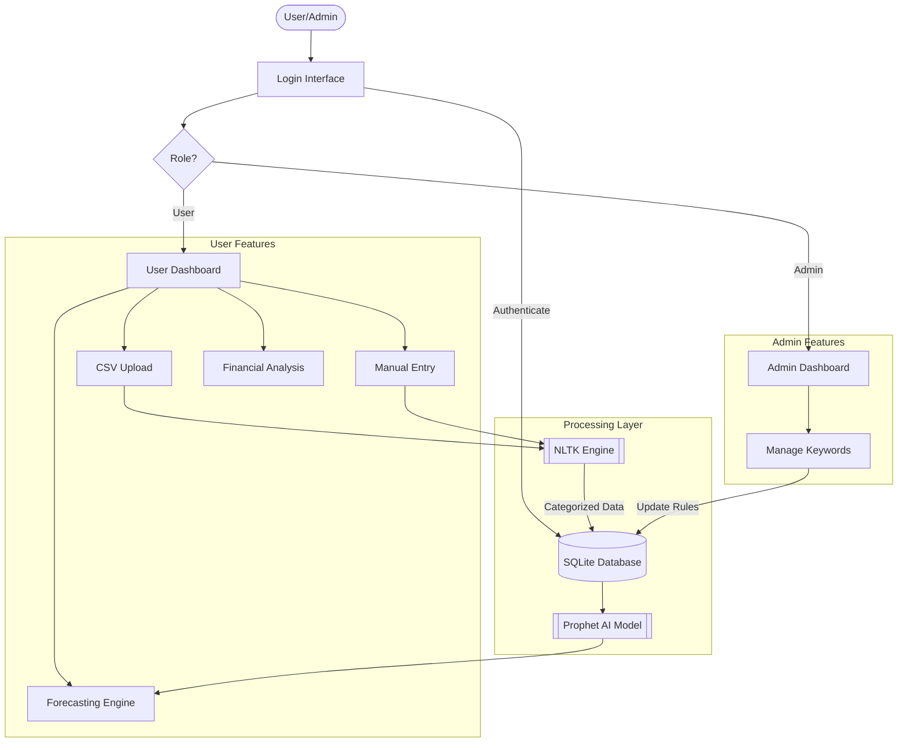

# BudgetWise

**BudgetWise** is an intelligent, data-driven personal finance application designed to help individuals track expenses, forecast future spending, and manage financial goals. Built with **Streamlit**, it leverages **Natural Language Processing (NLTK)** for automated transaction categorization and **Facebook Prophet** for predictive expense forecasting.

---

## Key Features

### Secure Authentication
* **Role-Based Access Control (RBAC):** Distinct dashboards for standard Users and Administrators.
* **Secure Login:** Password hashing (SHA-256) for secure credential storage.
* **Persistent Sessions:** User data remains secure and accessible throughout the session.

### AI-Powered Intelligence
* **Automated Categorization:** Uses **NLTK** (Natural Language Toolkit) to analyze transaction descriptions and automatically assign categories (e.g., "Uber" $\rightarrow$ "Transportation").
* **Predictive Forecasting:** Integrated **Prophet** model forecasts future spending trends up to 365 days in advance based on historical data.

### Interactive Dashboards
* **Financial Snapshot:** Real-time metrics for Income, Expenses, and Net Savings.
* **Visual Analytics:** Interactive charts (Altair & Matplotlib) showing spending breakdown by category, monthly trends, and yearly comparisons.
* **Transaction Editor:** A smart, paginated spreadsheet interface to view, edit, or delete transactions.

### Goal Setting & Tracking
* **Budget Management:** Set monthly spending limits for specific categories (e.g., Dining, Shopping).
* **Real-Time Alerts:** Visual progress bars turn red when you exceed your budget limit.

### Admin Control Panel
* **System Monitoring:** View total registered users, active goals, and transaction volume.
* **Dynamic Categories:** Add new categories or keywords instantly to the database to improve the AI categorization engine for all users without changing code.

---

## System Architecture

The application follows a modular architecture separating the user interface, logic processing, and data storage.




## Installation & Setup

Prerequisites: Ensure you have Python 3.8 or higher installed.

1.  **Clone the Repository**
    ```bash
    git clone [https://github.com/eshapriyanka/BudgetWise-AI-based-Expense-Forecasting-Tool](https://github.com/eshapriyanka/BudgetWise-AI-based-Expense-Forecasting-Tool.git)
    cd budgetwise
    ```

2.  **Set Up a Virtual Environment (Recommended)**
    It is best practice to use a virtual environment to manage dependencies.
    ```bash
    # For Windows
    python -m venv venv
    .\venv\Scripts\activate

    # For macOS/Linux
    python3 -m venv venv
    source venv/bin/activate
    ```

3.  **Install Dependencies**
    Install the necessary Python libraries used in the project:
    ```bash
    pip install streamlit pandas matplotlib seaborn nltk prophet altair
    ```

4.  **Run the Application**
    Launch the Streamlit server:
    ```bash
    streamlit run app.py
    ```

5.  **First Run Initialization**
    * The application will automatically handle the initial setup on the first launch.
    * It will create the local SQLite database file (`budgetwise_pro.db`) and populate it with the default transaction categories.
    * It will automatically download necessary NLTK data packages (`stopwords` and `punkt`) for the NLP engine.
    * The app should open automatically in your default web browser at `http://localhost:8501`.
